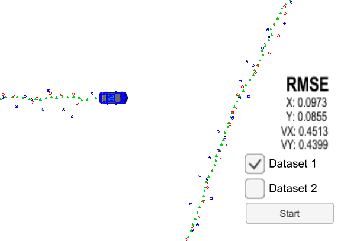
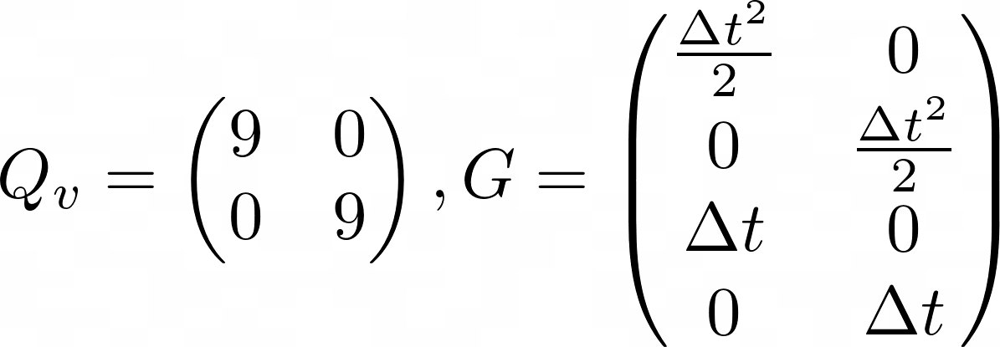
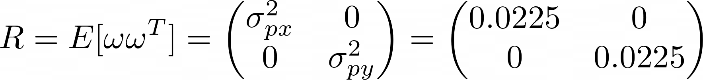
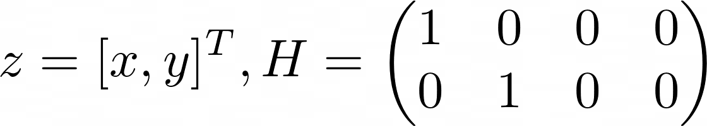
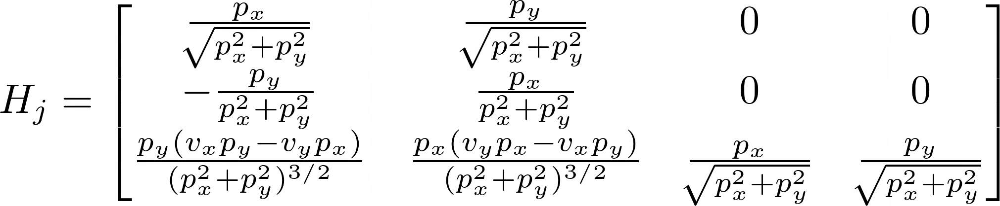
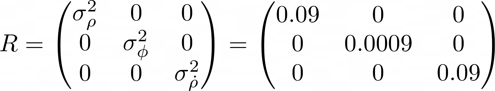
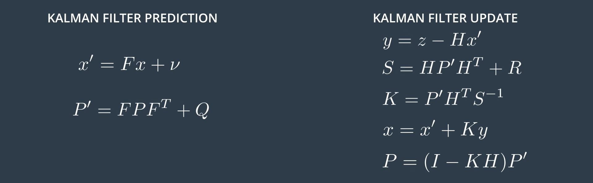
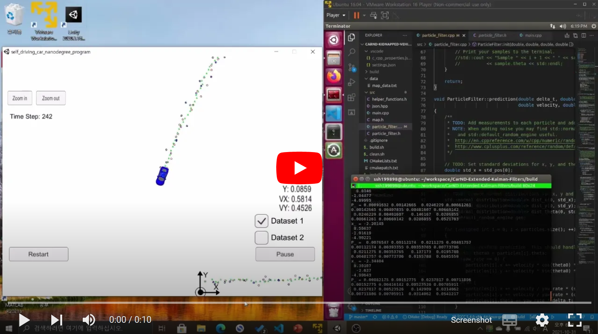

# Extended Kalman Filter Project

[](http://www.udacity.com/drive)


Self-Driving Car Engineer Nanodegree Program

In this project we will utilize a kalman filter to estimate the state of a moving object of interest with noisy lidar and radar measurements. Passing the project requires obtaining RMSE values that are lower than the tolerance outlined in the project rubric. 



## Dependencies and Build Instructions
- Please check the [starter code repository](https://github.com/udacity/CarND-Extended-Kalman-Filter-Project) of this project for environment setup and build. 
- This project involves the Term 2 Simulator which can be downloaded [here](https://github.com/udacity/self-driving-car-sim/releases).


# EKF Model Description
## State Space Vector
Basically, we first need to define the state space representation of object that we're going to track. I've defined the object as moving in **cartesian** 2-D space. The value that we want to figure out from the object is `x` and `y` **position**. Thus, the state vector consists of 
,  and it's first derivatives , 


## Motion Prediction
The state transition is simply linear in 2D spaces. However, because sensors' refresh rate are **not timely constant**, we have to take these into account when dealing with state transition and variances.

The **time variant** state transition equation is defined as below.


Also the **time variant process covariances** is derived as below. I don't write detailed derivation here. If you're interested, please check my blog [here](https://ssh199898.tistory.com/17?category=1008110) (written in Korean).


In this project, the acceleration covariance matrix  and  are given as below.




## Sensor Data
The data comes from two different simulated sensor model, **LIDAR** and **RADAR**.

### LIDAR Measurements
LIDAR sensor data gives the object's x and y position. Their position variances (acceleration noise) are given as `0.0225` for both .




The **measurement vector**  and **measurement matrix**  can simply be defined as below. Remember that  is defined as  where 




### RADAR Measurements
The need for extend kalman filters in sensor fusion comes from non-linearity of RADAR measurements. RADAR sensor gives the value in polar coordinates. It senses
 - the object's radial distance from the origin 
 - bearing angle 
 - speed in radial dirction. 

Thus if we want to convert these three values, we'll have to use nonlinear functions such as *square root* and *arctan*. However, this will cause the unimodality to be broken.

To linearlize this nonlinear function, we'll use Jacobian matrix of the function at object's predicted state. The calculated Jacobian is



In the project, the variances are given as,



# Extended Kalman Filter Code
Now let's dive into C++ code that I've written. Remember EKF formula below.



## Motion Prediction
Prediction is performed when new measurement arrives. This function explains the whole sequence of prediction.
```C++
void KalmanFilter::Predict(float delta_T) {
    // update state transition matrix and process covariance matrix
    MatrixXd F = GetF(delta_T);
    MatrixXd Q = GetQ(delta_T);

    // predict state
    x_ = F * x_; // + v

    // predict state covariance
    P_ = F * P_ * F.transpose() + Q;
}
```
`GetF` and `GetQ` function will calculate the **time variance** state transition matrix  and process covaraince matrix  based on the formulas above.
```C++
MatrixXd FusionEKF::CalculateF(float delta_T) {
    MatrixXd F = MatrixXd(4, 4);
    F << 1, 0, delta_T, 0,
        0, 1, 0, delta_T,
        0, 0, 1, 0,
        0, 0, 0, 1;

    return F;
};

MatrixXd FusionEKF::CalculateQ(float delta_T) {
    // measurement acceleration covariance
    float noise_ax = 9;
    float noise_ay = 9;

    MatrixXd Qv = MatrixXd(2, 2);
    Qv << noise_ax, 0,
        0, noise_ay;

    float sq = delta_T * delta_T / 2.0;
    MatrixXd G = MatrixXd(4, 2);
    G << sq, 0,
        0, sq,
        delta_T, 0,
        0, delta_T;

    MatrixXd Q = G * Qv * G.transpose();

    return Q;
};
```

## Measurement Update
For measurement update, we apply different pipeline by the sensor type.

### LIDAR Update
For LIDAR Update, simply perform the normal kalman filter update. It's very easy to understand the process! All matrices are constant. `GetH` and `GetR` always return same matrices.
```C++
void KalmanFilter::Update(const VectorXd &z) {
    /**
     * update the state by using Kalman Filter equations
     */
    MatrixXd H = GetH();
    MatrixXd R = GetR();
    long x_size = x_.size();
    MatrixXd I = MatrixXd::Identity(x_size, x_size);

    // measurement update
    VectorXd y = z - H * x_;
    MatrixXd S = H * P_ * H.transpose() + R;
    MatrixXd K = P_ * H.transpose() * S.inverse();

    // new estimate
    x_ = x_ + (K * y);
    P_ = (I - K * H) * P_;
}
```
### RADAR Update
This is where the nonlinearity comes in. Because the measurement matrix  is now a function of predicted state , we'll have to re-calculate it using  whenever RADAR measurements comes in. New verison of update function now have new functions for it.
```C++
void KalmanFilter::UpdateEKF(const VectorXd &z, 
                            VectorXd (*GetY)(const VectorXd&, const VectorXd&), 
                            MatrixXd (*GetHj)(const VectorXd&),
                            MatrixXd (*GetR)()) {
    /**
     * update the state by using Extended Kalman Filter equations
     */
    MatrixXd Hj = GetHj(x_);           // calculate jacobian using current state
    MatrixXd R = GetR();               // overrides member function
    long x_size = x_.size();
    MatrixXd I = MatrixXd::Identity(x_size, x_size);

    // measurement update
    VectorXd y = GetY(z, x_);          //y = z-hx, with angle normailzation
    MatrixXd S = Hj * P_ * Hj.transpose() + R;      //use Hj
    MatrixXd K = P_ * Hj.transpose() * S.inverse(); //use Hj

    // new estimate
    x_ = x_ + (K * y);
    P_ = (I - K * Hj) * P_;                         //use Hj
}
```
Let's take a glimpse into what `GetHj()` does. Okay... it seems to be just a hardcoded jacobian matrix! 
```C++
MatrixXd FusionEKF::CalculateRadarJacobian(const VectorXd &x_state) {
    MatrixXd Hj = MatrixXd(3, 4);
    Hj << 0, 0, 0, 0,
        0, 0, 0, 0,
        0, 0, 0, 0;
    // recover state parameters
    float px = x_state(0);
    float py = x_state(1);
    float vx = x_state(2);
    float vy = x_state(3);

    // if divided by zero, the measurement is overlaped with the car
    if (px * px + py * py == 0)
    {
        return Hj; //return zero value
    }

    float p_abs = sqrt(px * px + py * py);

    // compute the Jacobian matrix
    // derivative of rho
    Hj(0, 0) = px / p_abs;
    Hj(0, 1) = py / p_abs;

    // derivative of pi
    Hj(1, 0) = -py / (px * px + py * py);
    Hj(1, 1) = px / (px * px + py * py);

    // derivative of rho dot
    Hj(2, 0) = py * (vx * py - vy * px) / pow(p_abs, 3);
    Hj(2, 1) = px * (vy * px - vx * py) / pow(p_abs, 3);
    Hj(2, 2) = px / p_abs;
    Hj(2, 3) = py / p_abs;

    return Hj;
}
```

# Demo
We're all prepared. Here we go! Click the video thumbnail to watch demo in youtube.

> I was able to reach **RMSE** of `0.0973`!!


 